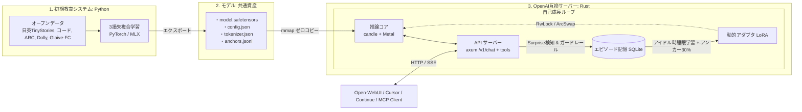
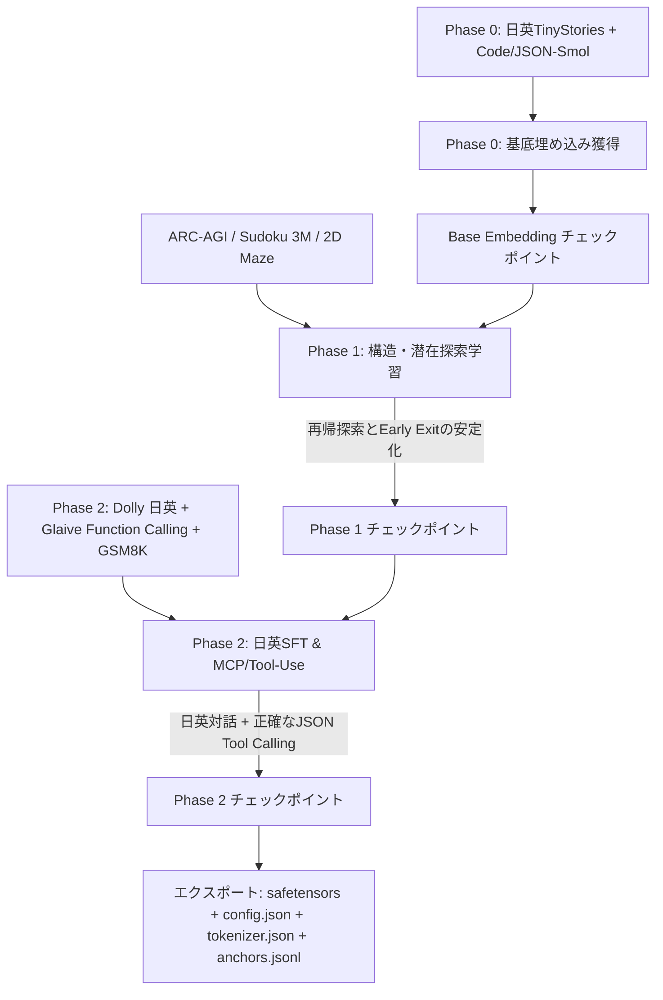

# Cotier (Cortical-Tier) アーキテクチャ & 詳細設計書

**システム名称**: `Cotier` (Cortical-Tier Recurrent Reasoning Engine)  
**モデル規模**: **0.45B (約 450M パラメータ / 4皮質スタック)**  
**ターゲット環境**: Apple Silicon (Mシリーズ / Unified Memory / macOS)  
**言語・ツール能力**: **日英バイリンガル ＋ プログラミングコード ＋ MCP (Model Context Protocol) ツール呼び出し**  
**実装スタック**: 
- **初期教育**: Python (PyTorch / MLX / Hugging Face)
- **推論・成長サーバー**: Pure Rust (`candle` + `axum` + `tokio` + Metal)

---

## 1. コア思想と基本方針

1. **脱・単語垂れ流し（Latent Reasoning）**
   - 従来の自然言語トークンを1語ずつ出力して思考する方式（CoT / `<think>`）から脱却。
   - モデル内部の潜在状態（Hidden State）を多重ループさせることで、言語を介さず頭の中（潜在空間）だけで推論を完結させる。
2. **思考深度（Time-Compute）のスケーリング**
   - 巨大モデル（70B〜）の丸暗記に頼るのではなく、**0.45B クラスの厳選された知識ベース** に対し、適応的な再帰ループ（$K=1\dots6$）を回すことで、省メモリ（<1GB）と超高速性（120+ tok/s）を維持しつつ 2B〜3B 級の論理推論力を引き出す。
3. **大脳皮質6層構造と能動的推論（Predictive Coding & PonderNet）**
   - 大脳皮質（Layer I〜VI）の機能分離と、停止確率（Halting Unit）による適応型計算リソース配分。
4. **日英・コード・MCP (Tool-Use) のネイティブ統合**
   - プロンプト文脈と MCP ツール定義（JSON Schema）を Layer I（Top-Down Invariants）に大域制約として保持し、Layer V の再帰で正確な引数 JSON を生成。
5. **会話を通じた生涯自己成長（Lifelong Active Learning）**
   - 推論と学習をシームレスに統合。海馬エピソード記憶（SQLite）と睡眠記憶固定化（Sleep Consolidation）により、モデルが自律的に成長する。

---

## 2. システム3大構造



| モジュール | 主な技術 | 役割と責務 |
| :--- | :--- | :--- |
| **① 初期教育システム**<br>(`train/`) | Python (PyTorch / MLX) | **「モデルの脳の基礎（思考回路・日英言語・ツール能力）を作る」**<br>・Phase 0: 日英＋コードの基底埋め込み獲得<br>・Phase 1: 構造推論（Layer V/VI 再帰探索）<br>・Phase 2: 日英SFT ＋ MCP/Tool-Use（指示追従・関数呼び出し）<br>・重みを `safetensors` としてエクスポート |
| **② モデル（共通資産）**<br>(`models/`) | safetensors / JSON / SQLite | **「教育成果と成長データの永続化」**<br>・静的ベース重み (`model.safetensors`)<br>・動的成長重み (`plastic_adapter.safetensors`)<br>・基礎アンカーデータ (`anchors.jsonl`)<br>・エピソード記憶DB (`memory.sqlite`) |
| **③ OpenAI互換サーバー**<br>(`server/`) | Rust (candle + axum) | **「Apple Silicon上で爆速稼働し、対話し、成長する」**<br>・Metalネイティブによる超高速推論（120〜150+ tok/s）<br>・`/v1/chat/completions` (SSEストリーミング & `tools` 対応)<br>・会話中の予測誤差検知とバックグラウンド記憶固定化 |

---

## 3. 6層皮質アーキテクチャ（Cortical Column Architecture）

モデルは **4つの皮質コラム（$N_{\text{layers}} = 4$）を縦にスタック** した構成をとり、各コラム内で Layer I〜VI の計算および Layer V の局所再帰を行います。

```
       [ Layer I : トップダウン不変条件 (Global Context & Modulator) ]
             │  ▲
             ▼  │ (状態注入 & 予測誤差フィードバック)
       [ Layer II/III : 横方向モジュール統合 (Lateral Integration) ]
             ▲
             │
       [ Layer IV : 感覚入力受容ゲート (Token / Layer Input Gateway) ]
             │
             ▼
 ┌───► [ Layer V : 因果Attention & 局所再帰コア (Recurrent Engine) ] ◄──┐
 │           │                                                        │
 │           ▼                                                        │ (内部ループ k = 1..K)
 └───  [ Layer VI : Ponder 停止ゲーティング (Early Exit / Halting Unit) ] ──┘
             │
             ▼
       [ 出力層 / 次層入力 (LM Head / Next Column Gateway) ]
```

### 3.1 テンソルシェイプとパラメータ規模 (Cotier-0.45B)
- **データ型**: `bfloat16` または `float32` (推論・学習時)
- **バッチサイズ**: 学習時 $B \in [8, 64]$, 推論時 $B = 1$
- **コンテキスト長**: $L \le 2048$
- **隠れ次元**: $D = 1024$
- **アテンションヘッド数**: $H = 16$ ($\text{Head Dim} = 64$)
- **中間FFN次元**: $D_{\text{ffn}} = 2816$ (SwiGLU: $\approx 2.75 \times D$)
- **皮質スタック数**: $N_{\text{layers}} = 4$
- **語彙サイズ**: $V = 32,000$ (日英・コード・JSON・Tool特殊トークン統合 BPE)
- **重み共有 (Weight Tying)**: 有効 (Embedding 重みと LM Head 重みを共有)
- **総パラメータ数**: **約 450M (0.45B)**
- **推論時メモリ消費**: **約 900 MB (bfloat16)** (KV Cache 込みで 1.5GB 未満)

---

### 3.2 厳密なレイヤー別計算式

各皮質層 $l \in [1, N_{\text{layers}}]$ において以下の計算を実行します（入力 $z_{\text{in}} \in \mathbb{R}^{B \times L \times D}$）。

1. **Layer IV (Input Gateway)**:
   - 最下層（$l=1$）ではトークン埋め込み、上位層では前層出力を正規化:
     $$z_{\text{L4}} = \begin{cases} \text{Embedding}(x) & (l = 1) \\ \text{RMSNorm}(z_{\text{out}}^{(l-1)}) & (l > 1) \end{cases}$$

2. **Layer I (Top-Down Invariants & Modulator)**:
   - 大域的文脈（システムプロンプトや MCP ツール情報）から制御状態 $z_{\text{L1}}$ を生成:
     $$z_{\text{L1}} = \text{RMSNorm}(W_{\text{L1}} \cdot \bar{z}_{\text{context}})$$

3. **Layer II/III (Lateral Integration & Context Binding)**:
   - 入力状態と大域制約を統合:
     $$z^{(0)} = \text{RMSNorm}(W_{\text{L2}} \cdot (z_{\text{L4}} + z_{\text{L1}}))$$

4. **Layer V (Recurrent Attention & SwiGLU Block - Fast Loop)**:
   - 再帰ステップ $k = 1 \dots K_{\text{max}}$ ($K_{\text{max}} = 6$) における内部ループ:
     $$a^{(k)} = \text{CausalSelfAttention}(\text{Q}=z^{(k-1)}, \text{K}=z^{(k-1)}, \text{V}=z^{(k-1)}, \text{RoPE})$$
     $$u^{(k)} = \text{RMSNorm}(z^{(k-1)} + a^{(k)} + z_{\text{L1}})$$
     $$\tilde{z}^{(k)} = z^{(k-1)} + \alpha \cdot \text{SwiGLU}(W_{\text{core}} u^{(k)}) \quad (\alpha = 0.1)$$
     $$z^{(k)} = \text{RMSNorm}(\tilde{z}^{(k)})$$

5. **Layer VI (PonderNet Halting Unit & Early Exit)**:
   - 停止確率 $h_k \in (0, 1)$ の算出（MLP分類器）:
     $$h_k = \sigma(W_{\text{halt}} z^{(k)} + b_{\text{halt}})$$
   - ステップ $k$ で停止する確率質量 $p_k$:
     $$p_k = h_k \prod_{j=1}^{k-1} (1 - h_j)$$
   - **推論時停止条件 (Decode時)**: $\sum_{j=1}^k p_j \ge 1 - \epsilon_{\text{halt}} \quad (\epsilon_{\text{halt}} = 0.05)$ または $k = K_{\text{max}} = 6$。
   - 収束状態 $z^{(\text{final})} = z^{(k_{\text{halt}})}$ を出力。

6. **LM Head (Emitter)**:
   - 最上層（$l=N_{\text{layers}}$）の収束状態からロジットを出力:
     $$\text{Logits} = \text{Linear}_{\text{head}}(z_{\text{final}}^{(N_{\text{layers}})}) \in \mathbb{R}^{B \times L \times V}$$

---

### 3.3 KV Cache & 推論時処理（Prefill vs Decode）

推論時の Metal 最適化と高速性を保証するため、プロンプト処理（Prefill）と逐次生成（Decode）を分離します。

```
【Prefill (プロンプト処理: L トークン)】
全トークンを並列計算 (固定 k=1 または k=2) ──► 最終 Key/Value を KV Cache に蓄積

【Decode (逐次生成: 1 トークン)】
新規トークンのみ k=1..6 を再帰計算 ──► 過去の KV Cache に対して Attention ──► Early Exit で即座に出力
```

1. **Recurrent Step Attention**:
   - 過去トークン $1 \dots t-1$ の Key / Value は「最終収束状態（$z^{(\text{final})}$）」のみを KV Cache に保持（メモリ使用量を通常モデルと同等に抑制）。
   - 生成中の現在トークン $t$ のみが $k=1 \dots K$ 回ループし、蓄積された KV Cache に対して Attention を実行。
2. **Prefill 並列化**:
   - プロンプト処理時はテンソル並列性を最大化するため、固定ステップ（$k=1$）で並列実行。
3. **Decode 適応型思考**:
   - 自己回帰生成時は 1 トークン単位で PonderNet が停止判定を行い、助詞や定型構文は $k=1$、論理・計算・JSON生成時は $k=4\dots6$ へ適応的に思考深度を深める。

---

## 4. 初期教育（Training）パイプライン

### 4.1 複合損失関数 (Joint Objective)
$$\mathcal{L}_{\text{total}} = \mathcal{L}_{\text{task}} + \lambda_1 \mathcal{L}_{\text{pred\_error}} + \lambda_2 \mathcal{L}_{\text{ponder}}$$

- $\mathcal{L}_{\text{task}}$: 各ステップの出力ロジットに対する重み付き期待Cross Entropy Loss:
  $$\mathcal{L}_{\text{task}} = \sum_{k=1}^K p_k \mathcal{L}_{\text{CE}}(\hat{y}^{(k)}, y)$$
- $\mathcal{L}_{\text{pred\_error}}$: 予測符号化整合損失 $\frac{1}{K} \sum_{k=1}^K \Vert z^{(k)} - z_{\text{L1}} \Vert_2^2$
- $\mathcal{L}_{\text{ponder}}$: PonderNet幾何分布正則化（ステップ期待値の最適化）:
  $$\mathcal{L}_{\text{ponder}} = D_{\text{KL}}(p_{1..K} \parallel \text{Geom}(\lambda_{\text{geom}}))$$

### 4.2 学習フェーズと公開データセット (日英・コード・MCP対応)



1. **Phase 0: 日英・コード基底事前学習 (Embedding Bootstrap)**
   - **データ**: `roneneldan/TinyStories` (英語), `TinyStories-ja` (日本語), `bigcode/the-stack-smol` (コード・JSON)
   - **目的**: 32,000語彙の日英・コード・JSON構文の埋め込み空間を形成。
2. **Phase 1: 構造化推論学習 (Structural Pre-training)**
   - **データ**: `fchollet/arc-agi`, `kyubyong/sudoku`, `Synthetic 2D Maze`
   - **目的**: 単純問題は $k=1$、複雑問題は $k=6$ を使う適応型思考深度（Ponder Halting）を獲得。
3. **Phase 2: 日英SFT ＆ MCP/Tool-Use 指示学習 (Instruction & Tool Alignment)**
   - **データ**: 
     - 対話: `databricks/databricks-dolly-15k` (英語), `kunishou/databricks-dolly-15k-ja` (日本語), `llm-jp/ichikara-instruction`
     - ツール呼び出し: **`glaiveai/glaive-function-calling-v2`** (MCP/JSON Tool Call形式)
     - 算術思考: `gsm8k` (英), `japanese-gsm8k` (日)
   - **目的**: 日英指示への追従に加え、MCPツール定義から正確な `<tool_call>{"name": ..., "arguments": ...}</tool_call>` を生成する能力を獲得。
4. **Phase 3: 共通フォーマット出力**
   - `model.safetensors`, `config.json`, `tokenizer.json`, `anchors.jsonl` をエクスポート。

---

## 5. モデル永続化・ストレージ詳細仕様 (`models/`)

### 5.1 ディレクトリ構成
```bash
~/projects/cotier/models/cotier-0.5b/
├── config.json                 # アーキテクチャ設定（D=1024, Layers=4 等）
├── tokenizer.json              # 日英・コード・Tool対応語彙（32,000語）
├── model.safetensors           # ベース重み（静的永続化 / 0.45B）
├── anchors.jsonl               # 忘却防止用基礎アンカーデータセット
├── plastic_adapter.safetensors # 会話で成長した動的LoRA重み（自動更新・永続化）
└── memory.sqlite               # 高Surprise対話ログ・エピソード記憶DB（永続化）
```

### 5.2 特殊トークン定義 (`tokenizer.json`)
```json
{
  "bos_token": "<|im_start|>",
  "eos_token": "<|im_end|>",
  "pad_token": "<|pad|>",
  "additional_special_tokens": [
    "<tool_call>",
    "</tool_call>",
    "<tool_response>",
    "</tool_response>",
    "<think>",
    "</think>"
  ]
}
```

### 5.3 エピソード記憶DBスキーマ (`models/cotier-0.5b/memory.sqlite`)
```sql
CREATE TABLE IF NOT EXISTS episodes (
    id INTEGER PRIMARY KEY AUTOINCREMENT,
    session_id TEXT NOT NULL,
    prompt TEXT NOT NULL,
    response TEXT NOT NULL,
    avg_surprise REAL NOT NULL,
    max_cycles INTEGER NOT NULL,
    user_feedback INTEGER DEFAULT 0, -- +1: 肯定/ツール成功, -1: 修正指示/エラー, 0: 未評価
    is_consolidated BOOLEAN DEFAULT 0,
    created_at TIMESTAMP DEFAULT CURRENT_TIMESTAMP
);

CREATE INDEX IF NOT EXISTS idx_episodes_unconsolidated 
ON episodes (is_consolidated, user_feedback, avg_surprise DESC);
```

### 5.4 動的アダプタと安全ガードレール (`plastic_adapter.safetensors`)
- **対象層**: 各皮質スタックの `l2_lateral` および `l5_core.down_proj`
- **LoRA Rank**: $r = 4$, $\alpha = 8$
- **学習対象ガードレール (Adversarial Drift 防止)**:
  - 睡眠学習の対象エピソードは **「ユーザー評価が $+1$」または「ツール実行が正常終了した高 Surprise 対話」** のみに厳格フィルタリング。
  - エラーやマイナス評価のエピソードは直接学習せず、修正プロンプトとの対比学習（Contrastive）時のみ利用。
- **破滅的忘却防止**: Replay学習時、必ず同梱の基礎アンカーデータ（`anchors.jsonl`）を **30% 混合** してグラディエントを計算。
- **排他制御と推論優先 (Preemption)**:
  - LoRA 重みの参照は `ArcSwap` で管理し、学習完了時にアトミックに差し替え。
  - 睡眠学習中にユーザーからの推論リクエストが届いた場合、学習ループを即座に一時中断（Yield）して推論を最優先処理。

---

## 6. 推論サーバー & OpenAI / MCP 互換プロトコル (`server/`)

### 6.1 `Cargo.toml` 依存仕様
```toml
[package]
name = "cotier-server"
version = "0.1.0"
edition = "2021"

[dependencies]
candle-core = { version = "0.8" }
candle-nn = { version = "0.8" }
candle-transformers = { version = "0.8" }
tokenizers = { version = "0.21", default-features = false, features = ["fancy-regex"] }
safetensors = "0.5"

# Web & 非同期
tokio = { version = "1.38", features = ["full"] }
axum = { version = "0.7", features = ["macros"] }
tower-http = { version = "0.5", features = ["cors", "trace"] }
async-stream = "0.3"
futures = "0.3"
arc-swap = "1.7"

# 永続化 & シリアライズ
rusqlite = { version = "0.31", features = ["bundled"] }
serde = { version = "1.0", features = ["derive"] }
serde_json = "1.0"
clap = { version = "4.5", features = ["derive"] }
tracing = "0.1"
tracing-subscriber = "0.3"

[features]
default = ["metal"]
metal = ["candle-core/metal", "candle-nn/metal"]
```

### 6.2 OpenAI / MCP 互換リクエスト・レスポンス型 (`src/server.rs`)
```rust
use serde::{Deserialize, Serialize};

#[derive(Debug, Deserialize)]
pub struct ToolFunction {
    pub name: String,
    pub description: Option<String>,
    pub parameters: serde_json::Value,
}

#[derive(Debug, Deserialize)]
pub struct ToolDefinition {
    pub r#type: String, // "function"
    pub function: ToolFunction,
}

#[derive(Debug, Deserialize)]
pub struct ChatMessage {
    pub role: String,
    pub content: Option<String>,
    pub tool_calls: Option<Vec<ToolCall>>,
}

#[derive(Debug, Deserialize, Serialize, Clone)]
pub struct ToolCall {
    pub id: String,
    pub r#type: String,
    pub function: FunctionCallPayload,
}

#[derive(Debug, Deserialize, Serialize, Clone)]
pub struct FunctionCallPayload {
    pub name: String,
    pub arguments: String, // JSON文字列
}

#[derive(Debug, Deserialize)]
pub struct ChatCompletionRequest {
    pub model: String,
    pub messages: Vec<ChatMessage>,
    pub tools: Option<Vec<ToolDefinition>>,
    #[serde(default)]
    pub temperature: Option<f32>,
    #[serde(default)]
    pub max_tokens: Option<usize>,
    #[serde(default)]
    pub stream: Option<bool>,
}

#[derive(Debug, Serialize)]
pub struct CorticalMetrics {
    pub cycles: usize,
    pub surprise: f32,
}

#[derive(Debug, Serialize)]
pub struct ChatChoiceDelta {
    pub content: Option<String>,
    pub tool_calls: Option<Vec<ToolCall>>,
    #[serde(skip_serializing_if = "Option::is_none")]
    pub cortical_metrics: Option<CorticalMetrics>,
}

#[derive(Debug, Serialize)]
pub struct ChatCompletionChunk {
    pub id: String,
    pub object: &'static str,
    pub created: u64,
    pub model: String,
    pub choices: Vec<ChatChoiceDeltaWrapper>,
}

#[derive(Debug, Serialize)]
pub struct ChatChoiceDeltaWrapper {
    pub index: usize,
    pub delta: ChatChoiceDelta,
    pub finish_reason: Option<String>,
}
```

---

## 7. CLI & 運用コマンド仕様

```bash
# 1. サーバー起動 (Metalアクセラレーション & MCP/Tool対応)
cotier serve --model ./models/cotier-0.5b --port 8080 --metal

# 2. CLI 単体対話モード (リアルタイム思考メーター表示)
cotier chat --model ./models/cotier-0.5b

# 3. 学習エピソード状態の確認
cotier memory status --model ./models/cotier-0.5b

# 4. モデルのロールバック (会話による過学習・破綻時の復元)
cotier rollback --model ./models/cotier-0.5b --to base
```

---

## 8. 全体ディレクトリ構成

```bash
~/projects/cotier/
├── ARCHITECTURE.md             # 本書（アーキテクチャ & 詳細設計書）
├── ROADMAP.md                  # 開発全体計画 & マイルストーン
├── data/                       # 前処理済みデータセット
├── train/                      # ① 初期教育システム (Python)
│   ├── scripts/
│   │   ├── 01_download_data.py # 日英・コード・MCPデータ自動取得
│   │   └── 02_preprocess.py    # トークン化 & Tool-Call整形
│   ├── src/
│   │   ├── model.py            # PyTorch版 4スタック皮質コラムモデル (0.45B)
│   │   ├── loss.py             # 3損失複合関数 (PonderNet KL Loss)
│   │   ├── train_phase0.py     # 日英・コード基底埋め込み学習
│   │   ├── train_phase1.py     # 構造推論学習
│   │   ├── train_phase2.py     # 日英SFT & MCP/Tool-Use学習
│   │   └── export.py           # safetensors, tokenizer, anchors出力
│   └── pyproject.toml
├── models/                     # ② モデル・永続化領域
│   └── cotier-0.5b/
│       ├── config.json
│       ├── tokenizer.json
│       ├── model.safetensors
│       ├── anchors.jsonl
│       ├── plastic_adapter.safetensors
│       └── memory.sqlite
└── server/                     # ③ OpenAI互換サーバー (Rust)
    ├── Cargo.toml              # candle, axum, tokio, metal, arc-swap
    └── src/
        ├── model.rs            # 4スタック皮質フォワードパス & Metal最適化
        ├── memory.rs           # SQLite エピソード記憶バッファ (ガードレール付)
        ├── learner.rs          # バックグラウンド記憶固定化 (Preemption対応 Sleep Trainer)
        ├── server.rs           # axum /v1/chat/completions (tools対応)
        └── main.rs             # CLI / サーバーエントリーポイント
```
